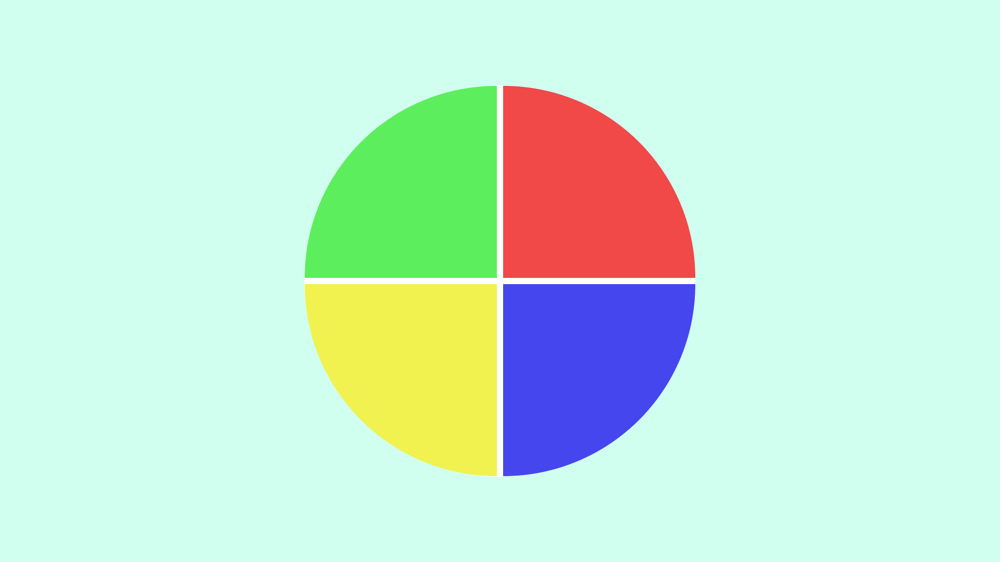

# Genius Game

Project provided in Javascript Developer Bootcamp by (DIO) Digital Innovation One

The Genius Game was the proposal for one of the courses presented in the **HTML Web Developer** bootcamp. Concepts about **CSS and Javascript** are covered in the course and emphasize the Game Development with Javascript. A flat graphic design and clear simple interface was developed using Grids.

This is an amazing game to challenge your self, friends and family. It's easy and simple to play and no experience is needed.

You can go to my github [page](https://rvsriller.github.io/rierGeniusGame/) and see how the first version of this game looks like :video_game: :video_game:

# Tecnologies

- HTML 5
- CSS 3
- Javascript ES 6

This lesson was presented by [Gabriela Pinhero](https://github.com/SpruceGabriela)
